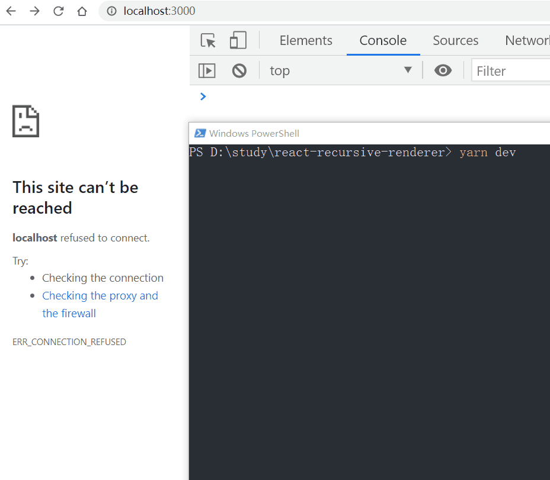

# react-recursive-renderer

递归渲染react的嵌套内容 | recursive render nested components with react



## 使用 | usage 

```
import { FC } from "react"
import Container, { RecursiveProps } from "../lib"

// recursively render `Ul` and it will get props of type `RecursiveProps`  
const Ul: FC<RecursiveProps> = ({ 
  getChildrenNodes, // 获取子节点的函数 | function that returns list of nested nodes
  val, // 从 `props` 或 `rootProps` 获取的值 | values from `props` or `rootProps`
  i,  // 当前节点在平辈中的序号 | index among peers
  depth // 当前嵌套深度 | current nested depth
}) => {
  let childNodes = getChildrenNodes()
  if (!childNodes.length) return <button
    onClick={() => console.log({ val, depth, i })}
  >{val}</button>
  return <><button style={{ color: 'red' }} onClick={() =>
    console.log({ val, depth, i })}  >{val}</button>
    <ul>{childNodes.map((x, i) => <li key={i}>{x}</li>)}</ul></>
}

const Index = () => {
  return (<Container
    Component={Ul /* nested component */}
    getChildrenProps={({ val }) => {
      return new Array(3).fill(0).map((x, i) => ({
        val: val * 10 + i + 1
      }))
    } /* function that recursively get nested children props */}
    depthLimit={3 /* depth limit, -1 for no limit */}
    rootProps={{ val: 1 } /* inital props for top level */} />)
}

export default Index
```